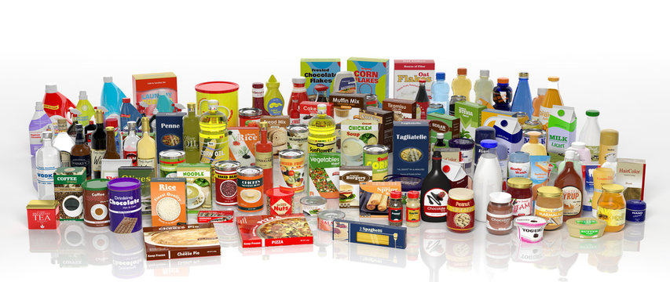
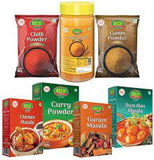

<html lang="en">

<head>
    <title>Apna Bazar</title>
    <!-- CSS only -->
    <link href="https://cdn.jsdelivr.net/npm/bootstrap@5.2.3/dist/css/bootstrap.min.css" rel="stylesheet"
        integrity="sha384-rbsA2VBKQhggwzxH7pPCaAqO46MgnOM80zW1RWuH61DGLwZJEdK2Kadq2F9CUG65" crossorigin="anonymous">
    <!-- JavaScript Bundle with Popper -->
    
    <link rel="stylesheet" href="https://cdnjs.cloudflare.com/ajax/libs/font-awesome/6.2.1/css/all.min.css"
        integrity="sha512-MV7K8+y+gLIBoVD59lQIYicR65iaqukzvf/nwasF0nqhPay5w/9lJmVM2hMDcnK1OnMGCdVK+iQrJ7lzPJQd1w=="
        crossorigin="anonymous" referrerpolicy="no-referrer" />
    <link rel="stylesheet" href="CSS/index.css" />

</head>

<body class="" style="background-color: #00ccff;">
    <container>
        <!-- Header -->
        

            <nav class="navbar navbar-expand-lg bg-light">
                

                    <a class="navbar-brand text-primary" href="#">
                        <h3>Apna Bazar</h3>
                    </a>
                    <button class="navbar-toggler" type="button" data-bs-toggle="collapse"
                        data-bs-target="#navbarSupportedContent" aria-controls="navbarSupportedContent"
                        aria-expanded="false" aria-label="Toggle navigation">
                        
                    </button>
                    

                        <ul class="navbar-nav me-auto mb-2 mb-lg-0">
                            <li class="nav-item">
                                <a class="nav-link active" aria-current="page" href="#">Home</a>
                            </li>
                            <li class="nav-item">
                                <a class="nav-link" href="adminlogin.php">Admin</a>
                            </li>
                            <li class="nav-item active">
                                <a class="nav-link" href="displayproduct.php">
                                    All Products
                                </a>

                            <li class="nav-item active">
                                <a class="nav-link " href="about.php">About</a>
                            </li>
                        </ul>

                        <form class="d-flex" role="search">
                            <input class="form-control me-2" type="search" placeholder="Search" aria-label="Search">
                            <button class="btn btn-outline-success" type="submit">Search</button>
                        </form>
                    

                

            </nav>
        

        <!-- Header end -->

        <!-- Carousel  -->
        

            

                

                    

                        

                    

                    

                        
                    

                    

                        
                    

                    

                        
                    

                    

                        
                    

                

                <button class="carousel-control-prev" type="button" data-bs-target="#carouselExampleControls"
                    data-bs-slide="prev">
                    
                    Previous
                </button>
                <button class="carousel-control-next" type="button" data-bs-target="#carouselExampleControls"
                    data-bs-slide="next">
                    
                    Next
                </button>
            

        

        <!-- Carousel end -->
        

            
        

        <!-- Items  -->
        

            

                
                

                    
<b>Apna Bazaar सबसे सस्ता सबसे अच्छा</b>

                    <a href="displayproduct.php"><button class="btn btn-outline-success btn-lg m-2 p-2 mt-5"> Click Here
                        </button></a>
                

            

            

                
                

                    
<b>RGS Printing Press</b>

                    <a href="displayproduct.php"><button class="btn btn-outline-success btn-lg m-2 p-2 mt-5"> Click Here
                        </button></a>
                

            

            

                
                

                    
<b>Offer Zone</b>

                    <a href="displayproduct.php"><button class="btn btn-outline-success btn-lg m-2 p-2 mt-5"> Click Here
                        </button></a>

                

            

            

                
                

                    
<b>RGS Printing Press</b>

                    <a href="displayproduct.php"><button class="btn btn-outline-success btn-lg m-2 p-2 mt-5"> Click Here
                        </button></a>
                

            

            

                
                

                    
<b>Apna Bazaar सबसे सस्ता सबसे अच्छा</b>

                    <a href="displayproduct.php"><button class="btn btn-outline-success btn-lg m-2 p-2 mt-5"> Click Here
                        </button></a>
                

            

        

        <!-- Items end -->

        <!-- categorise  -->
        <!-- 9 to 999 start-->
        

            <h3>9 TO 999 Items</h3>
             
            

                

                    
                    

                        
Gifts and Taddy items

                        <a href="details.php">
                            <button class="btn btn-outline-primary btn-lg mt-5 "> Click Here </button>
                        </a>
                    

                

                

                    
                    

                        
Plastic items

                        <a href="details.php">
                            <button class="btn btn-outline-primary btn-lg mt-5 "> Click Here </button>
                        </a>
                    

                

                

                    
                    

                        
Watter bottels

                        <a href="details.php">
                            <button class="btn btn-outline-primary btn-lg mt-5 "> Click Here </button>
                        </a>
                    

                

                

                    
                    

                        
Watches

                        <a href="details.php">
                            <button class="btn btn-outline-primary btn-lg mt-5 "> Click Here </button>
                        </a>
                    

                

                

                    
                    

                        
Bangles

                        <a href="details.php">
                            <button class="btn btn-outline-primary btn-lg mt-5 "> Click Here </button>
                        </a>
                    

                

            

            <a href="displayproduct.php">View More....</a>

        

        <!-- 9 to 999 end-->
         
        <!-- grocery start -->
        

            <h3>Grocery Items</h3>
             
            

                

                    
                    

                        
washing Powder

                        <a href="details.php">
                            <button class="btn btn-outline-primary btn-lg mt-5 "> Click Here </button>
                        </a>
                    

                

                

                    
                    

                        
Shampoo

                        <a href="details.php">
                            <button class="btn btn-outline-primary btn-lg mt-5 "> Click Here </button>
                        </a>
                    

                

                

                    
                    

                        
Oils

                        <a href="details.php">
                            <button class="btn btn-outline-primary btn-lg mt-5 "> Click Here </button>
                        </a>
                    

                

                

                    
                    

                        
Pulses

                        <a href="details.php">
                            <button class="btn btn-outline-primary btn-lg mt-5 "> Click Here </button>
                        </a>
                    

                

                

                    
                    

                        
Spices 

                        <a href="details.php">
                            <button class="btn btn-outline-primary btn-lg mt-5 "> Click Here </button>
                        </a>
                    

                

            

            <a href="displayproduct.php">View More....</a>

        

        <!--grocery end-->

        <!-- categorise end -->
        <!--Footer-->
        

            <!-- Footer -->
            <footer class="text-center text-lg-start bg-light text-muted" >
                <!-- Section: Social media -->
                <section class="d-flex justify-content-center justify-content-lg-between p-0 border-bottom">

                </section>

                <section class="">
                    

                        <!-- Grid row -->
                        

                            <!-- Grid column -->
                            

                                <!-- Content -->
                                <h6 class="text-uppercase fw-bold mb-4">
                                    <a href="#top"> <i class="fa fa-home me-3"></i>RGS Group
                                    </a>
                                </h6>
                                

                                    Rishu Apna Bazaar  
                                    Here you can buy grocery, Homecare, Personalcase, 99Store, Artificial Jewellery,
                                    Shoes and More.
                                     plese visits once.
                                

                            

                            <!-- Grid column -->

                            <!-- Grid column -->
                            

                                <!-- Links -->
                                <h6 class="text-uppercase fw-bold mb-4">
                                    Products
                                </h6>
                                

                                    <a href="#999" class="text-reset">9 To 999</a>
                                

                                

                                    <a href="#Grocery" class="text-reset">Grocery Items</a>
                                

                                

                                    <a href="#Top" class="text-reset">Top</a>
                                

                                

                                    <a href="#Bottom" class="text-reset">Bottom</a>
                                

                            

                            <!-- Grid column -->

                            <!-- Grid column -->
                            

                                <!-- Links -->
                                <h6 class="text-uppercase fw-bold mb-4">
                                    Useful links
                                </h6>
                                

                                    <a href="#Type" class="text-reset">Categories</a>
                                

                                

                                    <a href="#!" class="text-reset">....</a>
                                

                                

                                    <a href="#!" class="text-reset">...</a>
                                

                                

                                    <a href="#!" class="text-reset">....</a>
                                

                            

                            <!-- Grid column -->

                            <!-- Grid column -->
                            

                                <!-- Links -->
                                <h6 class="text-uppercase fw-bold mb-4">Contact</h6>
                                
<i class="fas fa-home me-3"></i> Varanasi Khusipur 221011

                                

                                    <i class="fas fa-envelope me-3"></i>
                                    rairishabh5001@gmail.com
                                

                                
<i class="fas fa-phone me-3"></i> 6201616907

                                
<i class="fas fa-print me-3"></i> 8434048874

                            

                            <!-- Grid column -->
                        

                        <!-- Grid row -->
                    

                </section>
                <!-- Section: Links  -->

                <!-- Copyright -->

                

                    <!-- Section: Social media -->
                    <section class="mb-4">
                        <!-- Facebook -->
                        <a class="btn text-white btn-floating m-1" style="background-color: #3b5998;" href="#!"
                            role="button"><i class="fab fa-facebook-f"></i></a>

                        <!-- Twitter -->
                        <a class="btn text-white btn-floating m-1" style="background-color: #55acee;" href="#!"
                            role="button"><i class="fab fa-twitter"></i></a>

                        <!-- Google -->
                        <a class="btn text-white btn-floating m-1" style="background-color: #dd4b39;" href="#!"
                            role="button"><i class="fab fa-google"></i></a>

                        <!-- Instagram -->
                        <a class="btn text-white btn-floating m-1" style="background-color: #ac2bac;" href="#!"
                            role="button"><i class="fab fa-instagram"></i></a>

                        <!-- Linkedin -->
                        <a class="btn text-white btn-floating m-1" style="background-color: #0082ca;" href="#!"
                            role="button"><i class="fab fa-linkedin-in"></i></a>
                        <!-- Github -->
                        <a class="btn text-white btn-floating m-1" style="background-color: #333333;" href="#!"
                            role="button"><i class="fab fa-github"></i></a>
                    </section>
                    <!-- Section: Social media -->
                

                <!-- Grid container -->

                <!-- Copyright -->
                

                    © 2020 Copyright:
                    <a class="text-white" href="https://rishuapnabazaar.netlify.app/">rishuapnabazaar</a>
                    <!-- Copyright -->
            </footer>
            <!-- Footer -->
        

        <!--Footer End-->
    </container>
</body>

</html>
